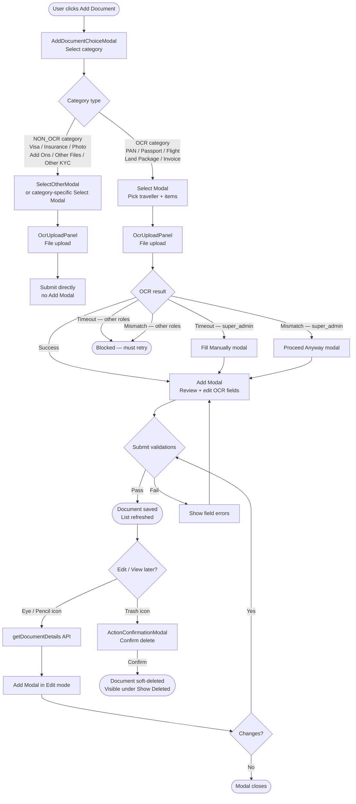
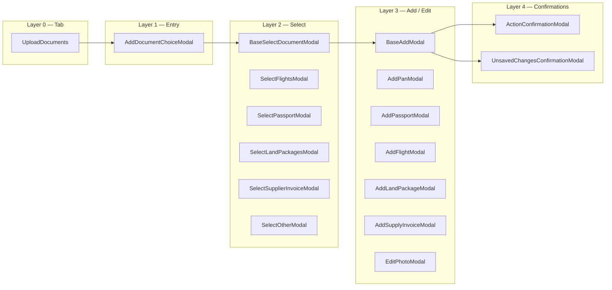

# Document Upload & Management – Product Specifications

---

## Documents Header

- **Add Document** button: Opens `AddDocumentChoiceModal` to select a document category before entering the upload flow.
- **Show Deleted** toggle: An Ant Design `Switch` with a static "Show Deleted" label. When checked, deleted documents are included in the fetch; when unchecked they are excluded. Accent color is `var(--new-ui-pink-main)`.
- **Collapse All / Expand All** button: toggles all category sections at once.
- Deleted items within a category are grouped in a collapsible "Deleted items" accordion at the bottom of that category. The count badge is right-aligned in the accordion header. Deleted rows are rendered with `opacity-70` and red borders.

---

## Sections

Documents are organised into 5 collapsible sections containing 13 categories:

1. **IDENTITY & KYC** — PAN, Passport, Photo, Other KYC
2. **TRIP VOUCHERS** — Flight Voucher, Hotels Voucher (Land Package), Visa, Insurance, Add Ons
3. **SUPPLIER INVOICES** — Invoice
4. **SCREENSHOT PROOF** — Flight Screenshots, Hotel Screenshots, Payment Screenshots, Other Screenshots _(no Add button — customer-uploaded only)_
5. **OTHER FILES** — Other Files

---

## Common for List Row Items

On the left: basic document info.
On the right:

- **Customer Uploaded** tag — shown when `customer_uploaded=true`. These documents are read-only and cannot be edited or deleted.
- **Edit / View** button — pencil icon for `pan` and `passport` (the only editable categories); eye icon for all others. Calls `getDocumentDetails` to open the modal.
- **Download** button — downloads the file(s) attached to the document.
- **Delete** button — opens a confirmation modal before deleting. Hidden on customer-uploaded documents.
  - Special warning when deleting the last KYC document (passport/pan) for a traveller: _"This is the only identity document for this traveller. Deleting it will remove all documents associated with this traveller."_

Both active and deleted documents within a category are sorted by `updated_at` descending (most recently modified first).

Each category has its own row format:

- **Passport row:** Passport number (title) · First name | Citizenship | Expiry date (subtitle) · Front/Back badge(s) with green checkmarks showing which sides are uploaded.
- **PAN row:** PAN number (title) · Name (subtitle).
- **Flight Voucher row:** "PNR: {pnr}" (title) · Flight segments (subtitle) · Green "Verified" badge.
- **Hotels Voucher row:** Component type + city or hotel name (title) · Hotel name (subtitle) · Green "Verified" badge.
- **Supplier Invoice row:** `vendor | date | invoice number` (title, missing parts omitted). Subtitle: items grouped by component (`hotel → activity → flight → addon`) with per-item amounts. Non-INR invoices show three lines on the right: original amount (xl), INR equivalent (sm), exchange rate (xs).
- **Others row (Visa, Insurance, Photo, etc.):** Document name or traveller name(s).

---

## Common for all Modals

- Spinner shown when something is loading (upload, OCR fetch, submission).
- User activity is disabled during loading (soft-disabled overlay).
- Submit button updates to **Saving…** with a spinner during submission.
- Modal label reflects the correct operation (Add / Edit / View + category name).
- Toast shown on successful submission.

---

## Common for all Select Modals

- Traveller selection always appears at the top of the left panel, above any other inputs.
- If the traveller list is empty, a message "Traveller list is empty." is shown with an "+ Add Traveller" button (where applicable). New travellers added client-side are named: "New Traveller", "New Traveller(1)", "New Traveller(2)", etc. Travellers are not auto-created on load.
- All enabled travellers are auto-selected on load (for multi-select categories).
- Disabled travellers and sides show a tooltip on hover explaining the reason.
- **Add button disabled state:** If no travellers exist and the category requires one, the Add button is disabled with tooltip: _"Add a traveller first to upload this document."_ Categories that don't require a traveller (screenshots, other files) are never disabled for this reason.
- The upload file icon is disabled until all required selections are made (traveller, supplier, etc.).
- Supported upload formats: `.jpg`, `.jpeg`, `.png`, `.pdf` — max file size 5 MB.
- If a file was already uploaded in this session (e.g. user pressed Back from Add Modal), the upload area shows an "already uploaded" state styled in the app's purple/pink theme with a "Click Next to proceed, or re-upload below" message and a Re-upload link.
- Pressing **Next** when a file is already uploaded (with no errors) re-triggers OCR on the existing file URL — the user does not need to re-upload. The Add Modal opens with a fetching state as usual.

---

## Common for all Add Modals

- When a Back button is applicable (multi-step flows where a Select Modal precedes the Add Modal), a left-arrow icon button is shown in the modal header to the left of the title — not in the footer.
- **Back navigation — passport special case:** If both front and back sides are uploaded and the user presses Back, the back side file and tag are stripped from the workflow and the user **stays in the Add Modal** (not navigated to the select modal). This lets them re-upload the back side without restarting the flow. For all other cases (any file has an error, or only one side uploaded), pressing Back clears files + OCR data and navigates to the select modal.
- In edit/view mode, a Delete (trash icon) button is shown in the modal header. Clicking it opens a confirmation modal before proceeding.
- In case of any error, a toast is shown and a banner is displayed on top of the image.
- Above the image preview, the following toolbar buttons appear:
  - **Maximize** — opens the image full-screen.
  - **Re-upload** — opens file picker and re-uploads. Clears any previous error.
  - **Download** — downloads the current file (shown in edit/view modes).
- Fields are locked by default after OCR. A pencil icon is shown to enter edit mode.
  - Clicking pencil makes all editable fields active. Pencil is replaced by a tick (confirm) and cross (cancel) icon.
  - Tick saves edits into form state. Cross discards all in-progress edits.
  - While in edit mode, the Save button is disabled — user must confirm or cancel edits first.
  - On re-upload/OCR, edit mode is reset automatically.
  - Enter key confirms the edit (same as clicking tick) when in edit mode.
- "Unable to extract" per-field errors are shown only if OCR ran in this session AND the field was returned empty.
- On submit, `ocr_extracted_data` is sent containing the raw OCR output from this session (before manual edits). If no OCR was run (e.g. editing without re-uploading), this is `null`. For passport, it is a per-side map (e.g. `{ front: {...}, back: {...} }`) — only sides where OCR ran this session are included.
- Save button is disabled if any file has an `errorMsg` (hard errors block saving entirely).
- The "Name verified manually" checkbox is removed — name mismatches not resolved by the identity check flow are hard errors for all roles.
- If the user attempts to close the modal after OCR data has changed, an **Unsaved Changes** confirmation modal appears with "Close" (discard) and "Save & Close" (submit then close) options.
- On pressing Submit:
  - Shows spinner with "Saving…" text.
  - All inputs are frozen.
  - Maximize and re-upload buttons remain visible but are non-interactive.

---

## Common for all Edit Modals

- Opens with label "Edit \<Category Name\>".
- Above the image: Download icon alongside the Re-upload icon.
- If nothing is changed, pressing Cancel closes without a prompt.
- If changed, a confirmation modal opens before discarding.
- Submit button (Save Changes) behaves the same as Add Modal.

---

## OCR Validations

All validations below run inside `handleFetchDocumentInfo` after OCR returns. They run in order — the first failure stops execution.

| #   | Validation                                                                                                | Applies To                                 | super_admin                                                             | Other roles                                                     |
| --- | --------------------------------------------------------------------------------------------------------- | ------------------------------------------ | ----------------------------------------------------------------------- | --------------------------------------------------------------- |
| 1   | **OCR network timeout** (`ECONNABORTED`)                                                                  | All categories                             | Confirmation modal — "Fill Manually" (proceed without OCR) or "Go Back" | Toast "OCR timed out. Please try again." + reset — blocked      |
| 2   | **Invoice / voucher OCR rejected with mismatches** (HTTP error + mismatches in response)                  | Invoice, Flight Voucher, Hotels Voucher    | Confirmation modal listing mismatches — can Proceed Anyway or Go Back   | `updateFileError` + toast "Invalid document uploaded" — blocked |
| 3   | **Voucher validation failed** (HTTP 200 but `validation_result.is_valid === false`)                       | Flight Voucher, Hotels Voucher             | Confirmation modal listing warnings — can Proceed Anyway or Go Back     | First error message shown + `updateFileError` + toast — blocked |
| 4   | **Passport expiry < `PASSPORT_MIN_VALIDITY_DAYS` (185) days after trip end**                              | Passport                                   | Toast shown, but **proceeds**                                           | `updateFileError` + toast — blocked                             |
| 5   | **Passport side mismatch** (OCR returns front but back was selected, or vice versa)                       | Passport                                   | Blocked — no bypass                                                     | Same                                                            |
| 6   | **Passport back — number doesn't match front**                                                            | Passport (back side only)                  | Blocked — no bypass                                                     | Same                                                            |
| 7   | **PAN number mismatch on edit** (OCR pan ≠ existing saved pan)                                            | PAN (edit only)                            | Blocked — no bypass                                                     | Same                                                            |
| 8   | **Same passport re-upload — non-name fields differ** (DOB, expiry, issue date, gender, citizenship, etc.) | Passport (edit, same passport number)      | Blocked — no bypass                                                     | Same                                                            |
| 9   | **Same passport re-upload — name fields differ** (first or last name mismatch)                            | Passport (edit, same passport number)      | Blocked — no bypass                                                     | Same                                                            |
| 10  | **Different passport number — OCR name doesn't fuzzy-match traveller profile**                            | Passport (edit, different passport number) | Confirmation modal — can Proceed or Go Back                             | Same                                                            |
| 11  | **Fresh add — OCR name doesn't fuzzy-match traveller profile**                                            | Passport, PAN (fresh add only)             | Confirmation modal — can Proceed or Go Back                             | Same                                                            |

**Outcomes legend:**

- **Blocked** — `updateFileError` sets a banner on the file + toast shown. Save button is disabled. User must re-upload.
- **Confirmation modal** — user is shown a modal and can choose to proceed or go back.
- **Proceeds** — validation passes (possibly with a warning toast) and OCR data is applied to the form.

---

## Role-Based Behaviour Summary

| Feature                                             | super_admin                             | Other roles        |
| --------------------------------------------------- | --------------------------------------- | ------------------ |
| OCR timeout                                         | Fill Manually modal                     | Blocked with toast |
| Invoice/voucher OCR rejected                        | Confirmation modal — can Proceed Anyway | Blocked            |
| Voucher validation failed (HTTP 200)                | Confirmation modal — can Proceed Anyway | Blocked            |
| Passport expiry invalid                             | Toast shown, proceeds                   | Blocked            |
| Passport side / number / field mismatches           | Blocked (no bypass)                     | Same               |
| Name mismatch (fresh add or passport number change) | Confirmation modal — can proceed        | Same               |
| Add new suppliers                                   | Yes                                     | No                 |
| Add new margin reasons / attributions               | Yes                                     | No                 |

---

## Select Modal Configuration

### KYC

- **PAN:** Single select traveller, no document name, traveller restriction (disabled if PAN already uploaded)
- **Passport:** Single select traveller, no document name, custom side-based restriction (see Passport section)
- **Photo:** Single select traveller, no document name, traveller restriction
- **Other KYC:** Single select traveller, document name required, no traveller restriction

---

### Trip Vouchers

- **Flight Voucher:** Multi-select traveller (all auto-selected), no document name, no traveller restriction. Flights selected from a list fetched per deal.
- **Hotels Voucher (Land Package):** Multi-select traveller (all auto-selected), no document name, no traveller restriction. Hotels and activities selected from separate lists fetched per deal.
- **Visa:** Single select traveller, no document name, traveller restriction
- **Insurance:** Single select traveller, no document name, traveller restriction
- **Add Ons:** Multi-select traveller (all auto-selected, but changeable), document name required, no traveller restriction

---

### Invoices

- **Supplier Invoice:** Multi-select traveller (all auto-selected), no document name, no traveller restriction. Supplier must be selected. `super_admin` can add new suppliers inline.
- **Other Invoice:** Multi-select traveller (all auto-selected, but changeable), document name required, no traveller restriction

---

### Screenshots & Other Files

- No traveller mapping.
- Document name required.
- No "Add" button — documents in these categories are customer-uploaded only.

---

# Category Wise Specification

---

## PAN

- **Label:** Add PAN | Edit PAN
- Single traveller selection only.
- **Mandatory:** Name, PAN Number.
- **Fields:** Name, PAN Number, Date of Birth, Father's Name, Mother's Name.
- All fields editable via pencil icon (available to all roles).
- Error if a non-PAN document is uploaded.
- **PAN format:** `^[A-Z]{5}[0-9]{4}[A-Z]{1}$` (e.g. `ABCDE1234F`).

### PAN Identity Checks (on OCR)

**Edit session (re-upload on existing document):**

- Same PAN number → proceed
- Different PAN number → hard error + reset (cannot save)

**Fresh add:**

- Fuzzy match OCR name vs traveller profile → proceed
- No match → confirmation popup ("traveller looks different, are you sure?")
  - Confirm → proceed
  - Cancel → stay on modal

### PAN Submit Validations

| #   | Check                                      | Error                                  |
| --- | ------------------------------------------ | -------------------------------------- |
| 1   | Edit mode with no changes                  | "No changes detected" → closes         |
| 2   | `name` required                            | "Name is required"                     |
| 3   | `pan_number` required                      | "PAN number is required"               |
| 4   | PAN format: `/^[A-Z]{5}[0-9]{4}[A-Z]{1}$/` | "Invalid PAN format (e.g. ABCDE1234F)" |

### PAN Row

- Top: PAN number
- Below: Name
- If PAN already uploaded for a traveller, that traveller is disabled in the select modal.

---

## Passport

- **Label:** Add Passport | Edit Passport
- Everything is tracked side-wise (front, back, or both).

### Select Modal

- Single traveller selection.
- Side options: Front, Back, Both.
- **Traveller restriction:** disabled only when both sides are fully uploaded (front + back, or "both" tag).
- **Side disable rules (with hover tooltips):**
  - Front not yet uploaded → "Back" disabled: _"Upload front side first"_
  - Front uploaded → "Front" disabled: _"Front side already uploaded"_
  - Back uploaded → "Back" disabled: _"Back side already uploaded"_
  - Any side uploaded → "Both" disabled: _"Cannot use 'Both' when a side is already uploaded"_
- Changing traveller resets side selection.

### Front Side Fields

- Passport Number (Mandatory)
- First Name, Last Name
- Citizenship
- Gender (Mandatory)
- Date of Birth
- Place of Birth, Place of Issue
- Date of Issue (Mandatory)
- Date of Expiry (Mandatory — permanently disabled, OCR-only)

### Back Side Fields

- Father's Name
- Spouse Name
- Address

### Rules

- All fields editable via pencil icon (all roles), except Date of Expiry (locked for all).
- If First Name or Last Name is empty after OCR: checkbox "First Name Unavailable" / "Last Name Unavailable" is automatically ticked and the input is disabled. Can only be unchecked in edit mode. Both names cannot be simultaneously unavailable.
- Passport must be valid for at least `PASSPORT_MIN_VALIDITY_DAYS` (185) days after the trip ends.
  - **super_admin:** Shown a warning toast but allowed to proceed.
  - **Other roles:** Hard error + blocked.

### UI Behaviour

- Side tabs to switch between uploaded sides.
- "Upload Front Passport" / "Upload Back Passport" buttons shown conditionally:
  - Hidden if that side is already uploaded in this session or a previous session.
  - "both" tag counts as both sides done.
- Errors are side-specific.
- Re-upload applies to the respective active side.
- Loading states are side-aware.

### Passport Identity Checks (on OCR)

Reference point: `initialDocumentDetailsRef` — captured once when the edit session opens, never mutated mid-session.

**Edit session (re-upload on existing document):**

_Same passport number:_

- Non-name fields (DOB, expiry, issue date, gender, citizenship, place of birth, place of issue, father's name, spouse name, address) — exact match required; any field differs → hard error + reset
- Name fields (first name, last name) — exact match (case-insensitive); any difference → hard error + reset

_Different passport number:_

- Fuzzy match OCR name vs **traveller profile name** (not the previously saved document)
  - Matches → proceed silently
  - No match → confirmation popup ("passport number changed and name doesn't match traveller profile")
    - Confirm → proceed · Cancel → stay on modal

**Fresh add:**

- Fuzzy match OCR name (`first_name + last_name`) vs traveller profile → proceed
- No match → confirmation popup
  - Confirm → proceed · Cancel → stay on modal

### Fuzzy Match Rules (shared across PAN + Passport, threshold: 0.8)

1. Exact match after normalization (lowercase, strip non-alpha, collapse spaces)
2. Space-collapsed match — `JOHNSMITH` ↔ `JOHN SMITH`
3. Word-subset — all words of shorter name appear in longer name's word list
4. Levenshtein similarity ratio ≥ 0.8

### Back Side — Additional Checks (on OCR)

After OCR, before general identity checks:

1. Passport number from back-side OCR must match the front side's passport number:
   - **Re-upload** (existing back document): compare against `initialDocumentDetailsRef.current.passport_number` — no API call
   - **Fresh add** (first upload of back): fetch front document via `getDocumentById` and compare
   - Mismatch → hard error + reset
2. If check passes → proceed directly to `updateDocumentDetails`, skipping the general identity block (back side has no name to compare)

### Passport Submit Validations

| #   | Check                                                                       | Error                                                                                                                 |
| --- | --------------------------------------------------------------------------- | --------------------------------------------------------------------------------------------------------------------- |
| 1   | Edit mode with no changes                                                   | "No changes detected" → closes                                                                                        |
| 2   | `passport_number`, `gender`, `date_of_issue`, `date_of_expiry` all required | "Please fill all the mandatory fields"                                                                                |
| 3   | Both FNU + LNU cannot be true simultaneously                                | "First name and Last name cannot both be unavailable"                                                                 |
| 4   | Passport number format: `/^[A-Z0-9]{6,12}$/`                                | "Invalid passport number (6–12 alphanumeric characters)"                                                              |
| 5   | `date_of_expiry` must be after `date_of_issue`                              | "Expiry date must be after issue date"                                                                                |
| 6   | Passport valid ≥ 185 days past trip end                                     | "Passport expiry should be at least 185 days after the trip ends ({date})" — `super_admin` can bypass, others blocked |

### Passport Row

- Top: Passport number
- Below: Name | Citizenship | Expiry date
- Right: Front/Back badge(s) with green checkmarks + Edit, Download, Delete

---

## Photo

- **Label:** Add Photo | Edit Photo

### Rules

- Single traveller selection.
- No Add Modal — file is submitted directly after upload (NON_OCR category).

### Edit

- Sellers can update the traveller assignment.
- Already-used travellers are disabled in the select.
- **super_admin** can re-assign photos between travellers (ignores document check).

### Photo Row

- Traveller name, or "N/A"

---

## Other KYC

- **Label:** Add Other KYC
- Single traveller selection.
- Document name required.
- No traveller restriction (same traveller can have multiple Other KYC docs).
- No Add Modal — file submitted directly after upload.

---

## Flight Voucher

- **Label:** Add Flight | Edit Flight

### Select Modal

- All travellers always auto-selected.
- Flights fetched from the deal's flight items list (disabled inactive flights).
- Same PNR allowed multiple times.

### Add Modal Fields

- **Booking:** PNR (required, 6 alphanumeric), Booking Date
- **Per flight segment:** Airline, Flight Number, Sector, Departure City, Departure Date, Departure Time, Arrival City, Arrival Date, Arrival Time
- **Per traveller:** Name, Ticket Number, Gender, Passenger Type

### Submit Validations

| #   | Check                                       | Error                                                      |
| --- | ------------------------------------------- | ---------------------------------------------------------- |
| 1   | Edit mode with no changes                   | "No changes detected" → closes                             |
| 2   | PNR format (if provided): `/^[A-Z0-9]{6}$/` | "PNR must be 6 alphanumeric characters (e.g. ABC123)"      |
| 3   | Per segment: arrival date ≥ departure date  | "Flight {n}: arrival date cannot be before departure date" |

### Auto-population

- If no OCR data, fields are pre-populated from selected flights and traveller list.

---

## Hotels Voucher (Land Package)

- **Label:** Add Land Package | Edit Land Package

### Select Modal

- All travellers auto-selected.
- Hotels and activities fetched separately; displayed in two CheckboxSelectLists (HOTEL, ACTIVITY).
- Can select a mix of hotels and activities in a single upload.

### Add Modal Fields

- **Hotel:** Hotel Name, Room Type, Meal Plan, Confirmation Number (required), Check-in Date, Check-out Date
- **Per activity:** Activity Name, Booking Number, Activity Date
- **Per guest:** First Name, Last Name

### Submit Validations

| #   | Check                                    | Error                                        |
| --- | ---------------------------------------- | -------------------------------------------- |
| 1   | Edit mode with no changes                | "No changes detected" → closes               |
| 2   | Confirmation Number required (UI-level)  | Field marked required                        |
| 3   | Checkout date must be after checkin date | "Check-out date must be after check-in date" |

### Auto-population

- Hotel details pre-filled from selected items; guest names from traveller list.

---

## Visa

- **Label:** Add Visa
- Single traveller selection.
- Traveller restriction (disabled if visa already uploaded for that traveller).
- No Add Modal — submitted directly after upload.

---

## Insurance

- **Label:** Add Insurance
- Single traveller selection.
- Traveller restriction (disabled if insurance already uploaded for that traveller).
- No Add Modal — submitted directly after upload.

---

## Add Ons

- Multi-select traveller (all auto-selected, but changeable).
- Document name required.
- No traveller restriction.
- No Add Modal — submitted directly after upload.

---

## Invoice

- **Label:** Add Supplier Invoice | View Supplier Invoice

### Select Modal

- Invoice items: Activity, Hotel, Flight, Add Ons.
- All travellers auto-selected for Flight/Hotel items.
- Supplier selection required (RoundedSelect at top of right panel).
- **super_admin** can add a new supplier inline via "Add new..." option.
- Supplier options are sorted alphabetically.
- Invoice items with `is_active = false` are disabled in the list (cannot be selected).
- Restores previous supplier and item selections on back-navigation.

### Add / View Modal

**Sticky header** (floats above scrollable item list) contains:

- Supplier name (with shop icon, from backend selection — read-only)
- Invoice number (inline editable via pencil)
- Invoice date (inline editable via pencil)
- Invoice amount (original currency + INR if non-INR invoice)
- Exchange rate — shown only for non-INR invoices, fetched for the invoice date (not latest). Label: "Rate as of invoice date". Auto-updates when invoice date changes.
- Balance — must be exactly 0 to save. Green when 0, red when negative, no colour when null (no amounts entered yet).

**OCR fetches:** Supplier, Invoice number, Invoice date, Amount.

**Mismatch handling:** The OCR payload includes pre-selected `invoice_items` and `supplier` for server-side verification. If rejected with mismatches:

- **super_admin:** Confirmation modal listing mismatches — Proceed Anyway or Go Back.
- **Other roles:** Blocked with error.

**Header edit mode:** Save button is disabled while in header edit mode with tooltip: _"Confirm or cancel header edits before saving."_

**Item groups:**

1. **Absolute amount split** (Hotels, Flights, etc.) — each item has: Name, Budget, Input amount, Margin status. If margin is low: Margin reason (dropdown), Attribution (dropdown), Remarks required. If margin is high: Remarks required.

2. **Activity cost group** — a single "Total Activity Cost" input distributes proportionally across all activities. Individual activity budgets are shown as disabled read-only. Shared margin fields (reason, attribution, remarks) apply to all activities at once. These shared values are stamped onto every activity item on submission.

**Budget fetch on open:** When the modal opens, available and consumed budgets are fetched per invoice item via API and applied to the tag list. Each item shows its `available_budget` (what's left to spend) and `consumed_budget` (already spent).

**Amount field behaviour:** When an item's `actual_cost_price` changes, `margin_reason`, `attribution`, and `remarks` are automatically cleared and the `margin_type` is recalculated immediately.

**Balance:** Invoice total − sum of all item amounts. Must be exactly 0 to submit.

**Exchange rate display format:** `1 {CURRENCY} ({symbol}) = {rate} Rupees (₹)` — e.g. `1 USD ($) = 83.33 Rupees (₹)`.

**Activity cost distribution (proportional split):** The total activity cost is split across individual activity items in proportion to their `available_budget`. Uses the **largest remainder method** to ensure the distributed amounts sum to exactly the entered total (no rounding drift).

**Auto-population:** If exactly one invoice item, its amount is auto-filled with the available budget (converted to invoice currency). One-shot — does not re-trigger on re-upload.

**View mode:** Opened directly from `allDocumentsData` — no extra API call. All fields read-only (no pencil, no footer). Exchange rate taken from stored `exchange_rate_inr` instead of fetching live.

### Submit Validations

| #   | Check                                                                                       | Error                                                                              |
| --- | ------------------------------------------------------------------------------------------- | ---------------------------------------------------------------------------------- |
| 1   | If header is in edit mode when Submit is pressed → saves header edits instead of submitting | —                                                                                  |
| 2   | Edit mode with no changes (both OCR data and tag list unchanged)                            | "No changes detected" → closes                                                     |
| 3   | `invoice_number` required                                                                   | "Invoice number required"                                                          |
| 4   | `invoice_date` required                                                                     | "Invoice date required"                                                            |
| 5   | `amount` required                                                                           | "Amount required"                                                                  |
| 6   | `amount_currency` required + must exist in currency list                                    | "Currency required" / "Invalid currency"                                           |
| 7   | Each item must have `actual_cost_price`                                                     | "Amount required" (per item)                                                       |
| 8   | Non-activity low margin → `margin_reason`, `attribution`, `remarks` required                | "Margin reason required" / "Attribution required" / "Remarks required"             |
| 9   | Non-activity high margin → `remarks` required                                               | "Remarks required"                                                                 |
| 10  | Activity group low margin → shared `margin_reason`, `attribution`, `remarks` required       | Same messages, at group level                                                      |
| 11  | Activity group high margin → shared `remarks` required                                      | "Remarks required"                                                                 |
| 12  | Balance must equal exactly 0 (Save button disabled)                                         | "Balance must be zero before saving" / "Enter amounts for all items before saving" |

### Margin Validation

- **> budget** → reason, attribution, remarks required
- **< 70% of budget** → remarks required
- **Otherwise** → normal (no extra fields)

Margin reason and attribution options can be created by `super_admin` only (inline "Add new…" in the dropdown).

### Supplier Invoice Row

- Title: `vendor | date | invoice number` (missing parts omitted).
- Subtitle: Items grouped by component (`hotel → activity → flight → addon`); unrecognised components appear last. Each group header shows component name in small uppercase. Per-item: name (truncated, full name on tooltip) + amount.
  - Non-INR: `₹{inr} ({original currency amount})`
  - INR: `₹{amount}` only.
- Right side for non-INR invoices: three lines — original amount (xl), INR equivalent (sm), exchange rate (xs).

---

## Screenshots (Flight / Hotel / Payment / Other)

- No Add button — documents are customer-uploaded only.
- No traveller mapping.
- Read-only rows (view only, no edit or delete).
- Customer Uploaded badge always shown.

---

## Other Files

- No traveller mapping.
- Document name required.
- Upload only — no Add Modal.

---

# Component Diagrams

## 1 — Full Component Hierarchy

```mermaid
graph TD
    UploadDocuments["UploadDocuments\n(Tab Container)"]

    UploadDocuments --> AddDocumentChoiceModal["AddDocumentChoiceModal\n(Category picker — external)"]
    UploadDocuments --> Sections["Sections\n(Config factory)"]
    UploadDocuments --> CategoryCard["CategoryCard\n(Per-category container)"]
    UploadDocuments --> ModalSystem["Modal System\n(via resolvedModal state)"]

    CategoryCard --> NoDocument["NoDocument\n(Empty state)"]
    CategoryCard --> Lists["Document Lists"]

    Lists --> FlightList --> BaseDocumentList1["BaseDocumentList"] --> FlightRow --> BaseDocumentRow
    Lists --> PassportList --> BaseDocumentList2["BaseDocumentList"] --> PassportRow --> BaseDocumentRow
    Lists --> PanList --> BaseDocumentList3["BaseDocumentList"] --> PanRow --> BaseDocumentRow
    Lists --> LandPackageList --> BaseDocumentList4["BaseDocumentList"] --> LandPackageRow --> BaseDocumentRow
    Lists --> SupplierInvoiceList --> BaseDocumentList5["BaseDocumentList"] --> SupplierInvoiceRow --> BaseDocumentRow
    Lists --> OthersList --> BaseDocumentList6["BaseDocumentList"] --> OthersRow --> BaseDocumentRow

    BaseDocumentRow --> ActionConfirmationModal["ActionConfirmationModal\n(Delete confirm)"]

    ModalSystem --> SelectModals["Select Modals\n(Step 1 of upload flow)"]
    ModalSystem --> AddEditModals["Add / Edit Modals\n(Step 2 of upload flow)"]

    SelectModals --> SelectFlightsModal --> BaseSelectDocumentModal
    SelectModals --> SelectPassportModal --> BaseSelectDocumentModal
    SelectModals --> SelectLandPackagesModal --> BaseSelectDocumentModal
    SelectModals --> SelectSupplierInvoiceModal --> BaseSelectDocumentModal
    SelectModals --> SelectOtherModal --> BaseSelectDocumentModal

    BaseSelectDocumentModal --> CheckboxSelectList
    BaseSelectDocumentModal --> OcrUploadPanel --> DocumentPreview
    SelectSupplierInvoiceModal --> RoundedSelect1["RoundedSelect\n(Supplier picker)"]

    AddEditModals --> AddPanModal --> BaseAddModal
    AddEditModals --> AddPassportModal --> BaseAddModal
    AddEditModals --> AddFlightModal --> BaseAddModal
    AddEditModals --> AddLandPackageModal --> BaseAddModal
    AddEditModals --> AddSupplyInvoiceModal --> BaseAddModal
    AddEditModals --> EditPhotoModal --> BaseAddModal

    BaseAddModal --> DocumentPreview2["DocumentPreview"]
    BaseAddModal --> ActionConfirmationModal2["ActionConfirmationModal\n(Delete / discard)"]
    BaseAddModal --> UnsavedChangesConfirmationModal
    AddSupplyInvoiceModal --> RoundedSelect2["RoundedSelect\n(Margin fields)"]
    AddPassportModal --> SelectField
    EditPhotoModal --> RoundedSelect3["RoundedSelect\n(Traveller)"]
```

---

## 2 — Upload Flow (User Journey)

---

## 3 — Modal Layering

---

# UI Components

## InputField

- Left padding (`pl-7`) applied only when a `prefix` is provided; otherwise `pl-3`.
- Right padding (`pr-7`) applied only when a `suffix` is provided; otherwise `pr-3`.
- Both can be active simultaneously (e.g. prefix + suffix → `pl-7 pr-7`).
