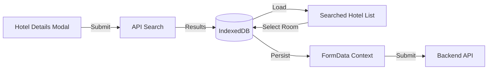
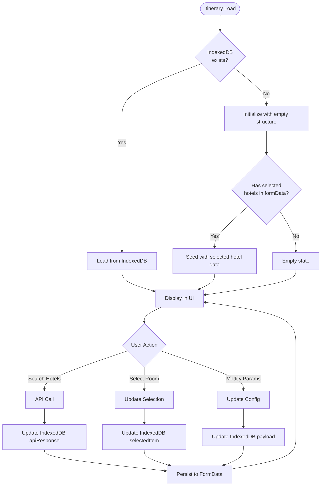

# Hotel Booking System Documentation

## Table of Contents

- [Overview](#overview)
- [Components](#components)
  - [Hotel Details Section](#hotel-details-section)
  - [Hotel Details Section Modal](#hotel-details-section-modal)
  - [Searched Hotel List](#searched-hotel-list)
  - [Room Selection](#room-selection)
  - [Hotel Manual Add Modal](#hotel-manual-add-modal)
- [Filtering and Sorting](#filtering-and-sorting)
  - [Sorting Options](#sorting-options)
  - [Filter Options](#filter-options)
- [Modify Search Hotels](#modify-search-hotels)
- [Data Flow](#data-flow)
- [State Management](#state-management)
- [Wishlist Feature](#wishlist-feature)
- [IndexedDB Integration](#indexeddb-integration)
- [Best Practices](#best-practices)
- [Error Handling](#error-handling)
- [Summary](#summary)

---

## Overview

This hotel booking system allows users to search, filter, and select hotels and rooms from multiple sources (TBO API and Travclan contracted hotels). The system supports multi-destination trips with comprehensive filtering options and maintains state through IndexedDB for persistence across page reloads. The system integrates with BigQuery for hotel data and uses real-time pricing through external APIs.

**Key Features:**

- Multi-destination hotel searches
- Real-time room availability and pricing
- Contracted and non-contracted hotel options
- Wishlist functionality for frequently used hotels
- Manual hotel entry for custom bookings
- Draft state management for unsaved changes
- IndexedDB for offline data persistence
- Session locking to prevent concurrent edits

---

## Components

### Hotel Details Section

#### Initial State (Before Adding Hotels)

- Displays empty hotel rows waiting for user configuration
- Shows search icon that opens the hotel search modal
- Each row displays: Nights, Check-in date, Location, Hotel Name, Room Type, Price

#### With Selected Hotels

- Displays hotel details for each destination
- Shows timestamps for last data fetch
- Displays action icons for each row:
  - **Search icon**: Open hotel search modal to configure search parameters
  - **Edit icon**: Navigate to hotel selection page (disabled if no search results available)
  - **Dropdown icon**: Expand to view additional hotel metadata
  - **Checkbox icon**: Mark hotel as booked (only for duplicated itineraries)

#### Hotel Row Structure

Each hotel row contains:

1. **Nights**: Number of nights for this destination (input field)
2. **Check-In**: Calculated check-in date based on previous hotels
3. **Location**: City/destination name (read-only from itinerary)
4. **Hotel Name**: Selected hotel name
5. **Room Type**: Selected room category
6. **Price**: Total price for the stay
7. **Metadata** (7th index): Additional details like star rating, meal plan, provider, contracted status

#### Booking Validation

When marking a hotel as "booked" (for duplicated itineraries):

- System validates that hotel details match the original itinerary
- Checks: nights, location, price, hotel name, and room type
- Prevents booking if any details have changed
- Shows validation errors with specific changes highlighted

---

### Hotel Details Section Modal

The main modal for configuring hotel search parameters before fetching results.

#### Modal Features

1. **Draft State Management**:

   - Changes are kept in temporary `draftHotels` state
   - Only committed to `formData` when "Submit" is clicked
   - Closing modal without submit discards changes

2. **Row Configuration**:

   - **Nights Selection**: Dropdown to select number of nights
   - **Check-in Date**: Auto-calculated based on start date and previous hotels
   - **Location Selector**: Dropdown to choose destination city
   - **Hotel Selector**: Multi-select chips for hotel search criteria
   - **Room Type**: Read-only display of selected room (populated after selection)
   - **Price**: Read-only display of total price

3. **Hotel Selection Modes**:

   - **Collection Hotels**: Automatically included (top contracted hotels)
   - **Wishlisted Hotels**: User's saved favorite hotels
   - **Manual Search**: Hotels manually selected from dropdown
   - **Booked By Guest**: Special option for customer-booked hotels

4. **Special Options** (Three-dot menu):

   - **Early Check-in**: Add extra night before arrival
   - **Late Check-out**: Add extra day after departure
   - **Manual Add**: Open manual entry modal for custom hotel details

5. **Add/Delete Rows**:

   - Add new hotel rows (up to total planned nights)
   - Delete existing rows
   - Rows automatically re-indexed after deletion

6. **Validation Rules**:
   - All rows must have nights selected
   - All rows must have location selected
   - Total nights must equal (numberOfDays - 1)
   - Start date must not be in the past
   - Changes must be made to enable Submit button

#### Working of Handle Search Hotels

```mermaid
flowchart TD
    Start([handleSearchHotels called]) --> CommitDraft[Commit draftHotels to formData]
    CommitDraft --> CleanupIndexedDB[Clean up IndexedDB if rows deleted]
    CleanupIndexedDB --> SetLoading[Set local loading state\nClose modal]
    SetLoading --> DetermineTabsToSearch{Modified rows exist?}

    DetermineTabsToSearch -->|Yes| UseModifiedRows[Search only modified rows]
    DetermineTabsToSearch -->|No| SearchAllRows[Search all rows]

    UseModifiedRows --> SetDestLoading
    SearchAllRows --> SetDestLoading[Set destination-specific loading states]

    SetDestLoading --> SetGlobalLoading[Set global fetchingStatus to 'fetching']
    SetGlobalLoading --> BuildPayload[Build search payload for each row]

    BuildPayload --> CheckManualEntry{Is manual entry\nor Booked By Guest?}

    CheckManualEntry -->|Yes| PersistToIndexedDB[Persist to IndexedDB\nSkip API search]
    CheckManualEntry -->|No| BuildHotelDetails[Build hotel_details array]

    PersistToIndexedDB --> RemoveFromModified[Remove from modified indices]
    RemoveFromModified --> NextRow{More rows?}

    BuildHotelDetails --> AddCollectionHotels[Add Collection Hotels\n- Always first priority]
    AddCollectionHotels --> AddWishlistedHotels[Fetch and add wishlisted hotels\n- User's favorites]
    AddWishlistedHotels --> AddManuallySelected[Add manually selected hotels\n- User's search criteria]
    AddManuallySelected --> CalculateDates[Calculate check-in/check-out dates\nHandle early checkin/late checkout]
    CalculateDates --> AddToPayload[Add to payloadForSearch.search_tabs]
    AddToPayload --> UpdateIndexedDB[Update IndexedDB with loading=true\nand payload]
    UpdateIndexedDB --> NextRow

    NextRow -->|Yes| CheckManualEntry
    NextRow -->|No| CheckPayloadEmpty{Payload empty?\nAll manual entries?}

    CheckPayloadEmpty -->|Yes| PersistAllToIDB[Persist all rows to IndexedDB\nShow success toast]
    CheckPayloadEmpty -->|No| CallAPI[Call fetchCollectionOfHotels API]

    PersistAllToIDB --> ClearLoadingStates[Clear all loading states]
    ClearLoadingStates --> End([End])

    CallAPI --> APISuccess{API Success?}

    APISuccess -->|No| ShowError[Show error toast\nClear loading states]
    APISuccess -->|Yes| ProcessResponse[Process search_tabs response]

    ShowError --> End

    ProcessResponse --> UpdateIndexedDBWithResults[Update IndexedDB:\n- apiResponse with hotels\n- Clear selectedItem\n- Set loading=false]
    UpdateIndexedDBWithResults --> UpdateTimestamp[Update timestamp for each tab]
    UpdateTimestamp --> ShowSuccessToast[Show success toast]
    ShowSuccessToast --> SetFetchedStatus[Set fetchingStatus='fetched']
    SetFetchedStatus --> ClearModifiedIndices[Clear modified row indices]
    ClearModifiedIndices --> ReEnableButtons[Re-enable search buttons]
    ReEnableButtons --> End

    style Start fill:#e1f5e1
    style End fill:#ffe1e1
    style CheckManualEntry fill:#fff4e1
    style DetermineTabsToSearch fill:#fff4e1
    style CheckPayloadEmpty fill:#fff4e1
    style APISuccess fill:#fff4e1
    style CallAPI fill:#e1f0ff
    style ProcessResponse fill:#e1f0ff
    style BuildPayload fill:#e1f0ff
    style PersistToIndexedDB fill:#ccffcc
    style UpdateIndexedDB fill:#ccffcc
```



#### Hotel Selector Component Behavior

The `HotelSelector` component manages hotel chips:

- **Searching State**: Shows search criteria as chips (can have multiple hotels)
- **Submitted State**: Shows selected hotel as a single pill (read-only)
- **Chip Management**:
  - Add hotels by selecting from dropdown
  - Remove hotels by clicking X on chip
  - Special handling for "Booked By Guest" option

---

### Searched Hotel List

The main page for browsing and selecting hotels and rooms after search is performed.

#### Layout Structure

Three-column layout:

1. **Left Sidebar** (20% width): Filters
2. **Middle Section** (55% width): Hotel cards with room options
3. **Right Sidebar** (25% width): Selected hotels summary

#### Navigation Elements

**Destination Tabs**

- Display all destinations at the top
- Color-coded loading states:
  - **Loading**: Spinner icon
  - **Loaded**: Check icon with green background
  - **Error**: Error state
- Click to switch between destinations
- Auto-scroll to selected destination on load (if coming from edit)

**Back Button**

- Returns user to the itinerary form
- Saves draft before navigation

**Continue/Submit Button**

- **Continue**: Shown for non-final tabs → advances to next destination tab
- **Submit**: Shown for final tab → saves all selections to IndexedDB and formData, then navigates back to form

#### State Persistence

Behavior depends on data source:

- **Coming from IndexedDB**: Restores search results and selected rooms
- **Fresh search**: Shows new results, clears previous selections for searched tabs
- **Page refresh**: Attempts to restore from localStorage (fallback mechanism)

#### Hotel Cards

**Card Structure**
Each hotel card displays:

- **Hotel Image**: Thumbnail (if available)
- **Hotel Name**: Formatted as Title Case
- **Star Rating**: Visual star display
- **Reviews**: Booking.com rating (if available)
- **Contracted Badge**: "©" symbol for contracted hotels
- **Recommended Badge**: Trophy icon for recommended properties
- **Private/SIC Tag**: Transfer type indicator
- **Wishlist Heart**: Add/remove from wishlist

**Room Display**

- Shows available room types within the card
- Each room has:
  - Room name
  - Board basis (meal plan)
  - Price (selling price)
  - Contracted status indicator
  - Radio button for selection

**Interaction**

- Clicking a room selects it (radio button)
- Selected room details appear in right sidebar
- Only one room can be selected per hotel
- Can select different hotels for different destinations

#### Fallback Hotels

For hotels with no available rooms:

- Displayed with "NOT AVAILABLE" tag
- Pricing shown as "N/A"
- Cannot be selected
- Still included in filtering

#### Data Sources

1. **TBO Hotels**: Live API data with real-time pricing
2. **Travclan Contracted**: BigQuery database with contracted rates
3. **Non-Contracted Hotels**: Additional options from database
4. **Manual Entry**: User-added custom hotels

---

### Room Selection

#### Room Selection Flow

1. **Browse Hotels**: User views hotel cards in middle section
2. **Select Room**: Click radio button for desired room
3. **Review Selection**: Selected room appears in right sidebar
4. **Submit**: Click Continue/Submit to save selection

#### Room Data Structure

```javascript
{
  hotelName: "Grand Bali Hotel",
  travclan_id: "12345",
  tbo_id: "TBO_67890",
  travclan_room_id: "ROOM_123",
  hotelIsContracted: true,
  roomIsContracted: true,
  roomDetails: {
    id: "ROOM_123",
    name: "Deluxe Ocean View",
    board_basis: {
      type: "Half Board"
    },
    price: 5000,          // Supply cost
    selling_price: 6000,  // Customer price
    rating: 4.5,
    std_room_id: "STD_123",
    supplier: "TBO",
    travclan_room_id: "ROOM_123"
  }
}
```

#### Selection Submission

When user clicks Continue/Submit:

1. Update IndexedDB with selected room details
2. Update formData.itinerary.hotels with selected hotel info
3. Navigate to next tab (Continue) or back to form (Submit)
4. Save to localStorage for persistence

---

### Hotel Manual Add Modal

Modal for manually entering hotel details when API data is unavailable or customer has specific requirements.

#### Fields

1. **Hotel Name** (CreatableSelect):

   - Dropdown with hotels from database
   - Can create new custom hotel
   - Auto-populates star rating if hotel exists

2. **Room Name** (Text Input):

   - Free text entry for room type
   - Examples: "Deluxe Room", "Ocean View Suite"

3. **Star Category** (Dropdown):

   - Options: 3, 4, 5 stars

4. **Nights** (Number Input):

   - Number of nights (pre-filled from row)

5. **Location** (Text Input):

   - Destination city (pre-filled from row)

6. **Booking.com Rating** (Number Input):

   - Optional rating out of 10

7. **Cost Price** (Currency Input):

   - Supply cost in INR

8. **Margin Percentage** (Number Input):

   - Profit margin percentage
   - Minimum constraints based on destination:
     - Europe: 5% minimum
     - Other destinations: 18% minimum

9. **Selling Price** (Currency Input):

   - Auto-calculated: Cost Price × (1 + Margin %)
   - Can be manually overridden

10. **Provider** (CreatableSelect):
    - Options: TBO, Travclan, Booking.com, MMT, Agoda
    - Can create custom provider

#### Validation Rules

- Star category is required
- Provider is required
- Hotel name is required
- Margin percentage must meet minimum thresholds:
  - Sales agents have stricter minimums
  - Admins can override

#### Manual Entry Behavior

When manual entry is submitted:

1. Updates draft state (if in modal) or formData directly
2. Sets `manualEntry: true` flag in metadata
3. Skips API search for this hotel row
4. Persists directly to IndexedDB
5. Hotel name shows in hotel selector as a chip

---

## Filtering and Sorting

### Sorting Options

Located in the left sidebar with enhanced dropdown styling.

#### Available Sort Options

1. **Rank (Default)**

   - Sorts by hotel static_score/rank
   - Considers price scores and hotel quality
   - Best overall value

2. **Price: Low to High**

   - Sorts by `selling_price` ascending
   - Shows cheapest options first

3. **Price: High to Low**

   - Sorts by `selling_price` descending
   - Shows premium options first

4. **Star Rating: High to Low**

   - Sorts by `star_rating` descending
   - Shows highest quality first

5. **Star Rating: Low to High**

   - Sorts by `star_rating` ascending

6. **Reviews: High to Low**

   - Sorts by `reviews` (Booking.com rating) descending

7. **Reviews: Low to High**

   - Sorts by `reviews` ascending

8. **Contracted First**
   - Shows contracted hotels at the top
   - Then sorted by rank

**Sort Persistence**

- Sort selection persists per tab
- Resets to default when switching tabs
- Saved in component state

---

### Filter Options

Located in the left sidebar, filters are applied in real-time.

#### Search Filter

- **Text Input**: Search by hotel name
- **Behavior**: Case-insensitive partial matching
- **Icon**: Search icon with enhanced styling

#### Type Filter

- **Checkboxes**: Private / SIC
- **Behavior**: Show hotels matching selected transfer types
- **Multiple Selection**: Can select both

#### Star Rating Filter

- **Checkboxes**: 3 Star / 4 Star / 5 Star
- **Behavior**: Show hotels matching selected star ratings
- **Multiple Selection**: Can select multiple ratings

#### Price Range Filter

- **Slider**: Min to Max price range
- **Dynamic Range**: Calculated from currently displayed hotels
- **Display**: Shows selected range with rupee symbol
- **Behavior**: Filters hotels within selected price range

#### Recommended Filter

- **Checkbox**: Show only recommended hotels
- **Badge**: Trophy icon in hotel cards

#### Contracted Filter

- **Checkbox**: Show only contracted hotels
- **Badge**: "©" symbol in hotel cards

#### Clear All Filters

- **Button**: Resets all filters to initial state
- **Icon**: Clear icon
- **Behavior**: Includes clearing search text

**Filter Persistence**

- Filters persist per tab
- Reset when switching tabs
- Saved in component state

---

## Modify Search Hotels

### Behavior

Same modal component as "Search Hotels" (`HotelDetailsSectionModal`) with different context:

**Key Differences**:

- Opened from "Modify Search" button in `SearchedHotelList`
- Pre-populated with current search parameters
- Uses temporary states in `SearchedHotelList` component
- Does **not** save to formData or localStorage until user clicks Submit in `SearchedHotelList`

### Workflow

1. User clicks "Modify Search" in `SearchedHotelList`
2. Modal opens with current parameters
3. User modifies nights, locations, or hotel selections
4. On Submit:
   - New API search is triggered
   - Results appear in `SearchedHotelList`
   - Previous selections are cleared for modified tabs
5. User must click Submit in `SearchedHotelList` to persist changes

### Modified Row Tracking

System tracks which rows were modified using `modifiedRowIndices` Set:

- Only modified rows are re-searched
- Unmodified rows retain their data
- Optimizes API calls and preserves selections

---

## Data Flow

### Data Sources

1. **IndexedDB**: Primary storage for hotel search results and selections

   - Key: `hotels_${formData.id}`
   - Structure: Array of hotel objects per destination

2. **FormData Context**: Application state for itinerary

   - `formData.itinerary.hotels`: Hotel selections
   - Structure: Object with numeric keys (0, 1, 2, ...)

3. **Local Storage**: Fallback for page refresh

   - Key: `hotels_${dealId}`
   - Contains: data, payloadHotel, hotels, hotelsByTabAndPage, selectedRoomDetails

4. **BigQuery**: Hotel database

   - Contracted hotels
   - Non-contracted hotels
   - Hotel metadata

5. **TBO API**: Live hotel availability and pricing

### formData.itinerary.hotels Structure

```javascript
{
  itinerary: {
    hotels: {
      0: [
        "12345",              // [0] travclan_id
        3,                    // [1] nights
        "Bali",              // [2] location
        6000,                 // [3] price (selling_price)
        "Grand Bali Hotel",   // [4] hotel name
        "Deluxe Room",        // [5] room type
        true,                 // [6] room selected flag
        {                     // [7] metadata
          tbo: "TBO_67890",
          travclan_room_id: "ROOM_123",
          meal_plan: "Half Board",
          supply_cost_inr: 5000,
          star_category: "5",
          bookingcom_ratings: "8.5",
          isHotelContracted: true,
          isRoomContracted: true,
          provider: "TBO",
          std_room_id: "STD_123",
          booked: false,
          earlyCheckin: false,
          lateCheckout: false,
          manualEntry: false
        }
      ],
      1: [/* Second destination */],
      // ... more destinations
    }
  }
}
```

### IndexedDB Structure

```javascript
[
  {
    selectedItem: {
      hotelName: "Grand Bali Hotel",
      travclan_id: "12345",
      tbo_id: "TBO_67890",
      travclan_room_id: "ROOM_123",
      hotelIsContracted: true,
      roomIsContracted: true,
      roomDetails: {
        id: "ROOM_123",
        name: "Deluxe Room",
        board_basis: { type: "Half Board" },
        price: 5000,
        selling_price: 6000,
        rating: 4.5,
        std_room_id: "STD_123",
        supplier: "TBO",
        travclan_room_id: "ROOM_123",
      },
    },
    apiResponse: {
      tab_id: "0",
      checkin_date: "2025-01-15",
      checkout_date: "2025-01-18",
      nights: 3,
      hotels: [
        /* Array of hotel objects with room details */
      ],
    },
    loading: false,
    isSearched: true,
    destination: "Bali",
    payload: {
      /* Search payload used */
    },
  },
  // ... more destinations
];
```

---

## State Management

### Component State Flow

#### 1. Hotel Details Section Modal

**Local States**:

- `draftHotels`: Temporary changes to hotel configuration
- `initialHotelsState`: Snapshot of hotels when modal opened
- `modifiedRowIndices`: Set of row indices that were modified
- `selectedHotels`: Hotel chips for search criteria (not final selection)

**Workflow**:

1. Modal opens → copy formData.itinerary.hotels to draftHotels
2. User makes changes → update draftHotels only
3. User clicks Submit → commit draftHotels to formData → trigger API search
4. User closes modal → discard draftHotels

**Change Detection**:

- Compares `draftHotels` with `initialHotelsState`
- Submit button enabled only if changes detected AND validations pass

#### 2. Searched Hotel List States

**Primary States**:

- `hotels`: Mapped hotel data per tab
- `selectedRoomDetails`: Currently selected rooms per tab
- `filters`: Filter state per tab
- `sortBy`: Sort option per tab
- `activeTab`: Current destination tab index

**Tab-Specific States**:
All states are maintained separately for each destination tab to allow independent filtering and selection.

#### 3. IndexedDB Sync Flow



#### 4. Draft State Pattern

The system uses a consistent draft-based pattern:

1. **Modal Opens**: Create draft copy of current state
2. **User Edits**: Modify draft only
3. **Submit**: Commit draft to permanent state
4. **Cancel**: Discard draft

**Benefits**:

- Clear separation between temporary and permanent changes
- Easy to implement "Cancel" behavior
- Prevents accidental data loss
- Allows validation before commitment

---

## Wishlist Feature

### Purpose

Allows users to save frequently used hotels for quick access in future itineraries.

### Functionality

**Adding to Wishlist**:

1. User clicks heart icon on hotel card
2. System calls `addToWishlist` API
3. Hotel TBO ID saved per user per destination/city
4. Heart icon turns solid (filled)
5. Success toast appears

**Removing from Wishlist**:

1. User clicks filled heart icon
2. System calls `removeFromWishlist` API
3. Hotel removed from user's wishlist
4. Heart icon returns to outline
5. Success toast appears

**Wishlist Integration in Search**:

- When hotels are searched, wishlisted hotels are automatically included
- Wishlisted hotels enriched with existing data from contracted/non-contracted hotels
- Displayed alongside collection and manually selected hotels
- Identified by `is_wishlisted: true` flag in hotel_details

### Wishlist Popup Component

**Features**:

- Shows all wishlisted hotels for a destination
- Displays hotel name, star rating, contracted status
- Remove button for each hotel
- Close button to dismiss

---

## IndexedDB Integration

### Purpose

IndexedDB provides:

1. **Persistence**: Survive page refreshes
2. **Performance**: Avoid re-fetching search results
3. **Offline Support**: Access data without network
4. **Large Data**: Store extensive hotel and room data

### Key Functions

#### saveHotels(key, data)

- **Purpose**: Initialize IndexedDB with hotel data structure
- **When**: First time modal is opened
- **Data**: Array of destination objects with empty apiResponse

#### getHotels(key)

- **Purpose**: Retrieve all hotel data for an itinerary
- **Returns**: Array of hotel objects per destination

#### updateHotels(key, path, value)

- **Purpose**: Update specific fields using dot notation
- **Example**: `updateHotels('hotels_12345', '0.selectedItem', roomData)`
- **Usage**: Update loading states, API responses, selections

#### emptyHotelForIndex(key, path)

- **Purpose**: Clear specific field while maintaining structure
- **Usage**: Clear selections when location or nights change

#### appendHotelsToApiResponse(key, tabIndex, newHotels)

- **Purpose**: Merge new hotels with existing results (for pagination)
- **Usage**: Load more results without replacing existing data

#### deleteItemAtIndex(key, index)

- **Purpose**: Remove entire destination entry
- **Usage**: When hotel row is deleted

### Data Lifecycle



---

## Best Practices

### For Users

1. **Always Submit**: Click Submit in Searched Hotel List to save selections
2. **Modify Search**: Use Modify Search to experiment before committing
3. **Wishlists**: Add frequently used hotels to wishlist for faster access
4. **Manual Entry**: Use manual add for hotels not in system
5. **Review Selections**: Check right sidebar before submitting
6. **Validate Before Booking**: Ensure all details match before marking as booked

### For Developers

1. **Draft State Pattern**: Always use draft states in modals
2. **IndexedDB First**: Read from and write to IndexedDB for hotel data
3. **Tab Independence**: Maintain separate state for each destination tab
4. **API Optimization**: Only search modified rows when possible
5. **Error Handling**: Gracefully handle API failures and IndexedDB errors
6. **Data Validation**: Validate before persisting to formData
7. **State Consistency**: Keep IndexedDB, formData, and UI in sync
8. **Session Locking**: Respect session locks to prevent concurrent edits
9. **Timestamp Tracking**: Update timestamps after searches for audit trail

---

## Error Handling

### Common Scenarios

1. **API Failures**:

   - Show error toast
   - Keep existing data
   - Re-enable search buttons
   - Set fetchingStatus to 'error'

2. **No Results**:

   - Show "No hotels found" message
   - Suggest modifying search criteria
   - Allow manual entry as fallback

3. **IndexedDB Errors**:

   - Fallback to localStorage
   - Re-initialize if corrupted
   - Console log errors for debugging

4. **Session Lock Conflicts**:

   - Show lock takeover notification
   - Disable editing if not lock owner
   - SSE connection for real-time updates

5. **Invalid Selections**:
   - Validate before allowing submission
   - Show specific error messages
   - Prevent navigation until resolved

### Recovery Strategies

1. **Page Refresh**:

   - Try IndexedDB first
   - Fallback to localStorage
   - Last resort: re-fetch from backend

2. **Data Corruption**:

   - Clear IndexedDB entry
   - Re-initialize with formData
   - Trigger fresh search

3. **API Timeout**:
   - Show loading state
   - Allow user to cancel
   - Retry mechanism for critical calls

---

## Summary

This hotel booking system provides a robust, multi-step process for searching and selecting hotels:

1. **Configure**: Set up nights, locations, and search criteria in modal
2. **Search**: Fetch hotels from multiple sources (API + Database)
3. **Browse**: View filtered and sorted hotel options with rooms
4. **Select**: Choose specific rooms for each destination
5. **Modify**: Adjust parameters as needed
6. **Submit**: Persist selections to IndexedDB and formData

**Key Design Principles**:

- **Draft-based state management** for safe editing
- **Tab-independent state** for multi-destination support
- **IndexedDB-first architecture** for data persistence
- **Graceful fallbacks** for offline and error scenarios
- **Real-time updates** via SSE for session management
- **Wishlist integration** for improved UX
- **Manual entry support** for flexibility

**Data Flow Hierarchy**:

1. IndexedDB (primary storage)
2. FormData Context (application state)
3. Local Storage (fallback)
4. Backend API (source of truth)

The system balances between automated hotel searches and manual flexibility, providing users with comprehensive options while maintaining data integrity through validation and state management patterns.
