# StepsContainer Component Documentation

## Overview

`StepsContainer` is a multi-step wizard component that manages the itinerary creation flow. It supports both a standard 5-step flow and special destination flows with customizable steps (e.g., Maldives SIS with only 2 steps).

---

## Table of Contents

1. [Architecture Overview](#architecture-overview)
2. [Special Destination Configuration](#special-destination-configuration)
3. [Step Flow](#step-flow)
4. [State Management](#state-management)
5. [Step Handlers System](#step-handlers-system)
6. [Navigation System](#navigation-system)
7. [Search Operations](#search-operations)
8. [Completion Flow](#completion-flow)
9. [UI Layout](#ui-layout)
10. [Key Functions Reference](#key-functions-reference)
11. [Data Flow Diagrams](#data-flow-diagrams)

---

## Architecture Overview

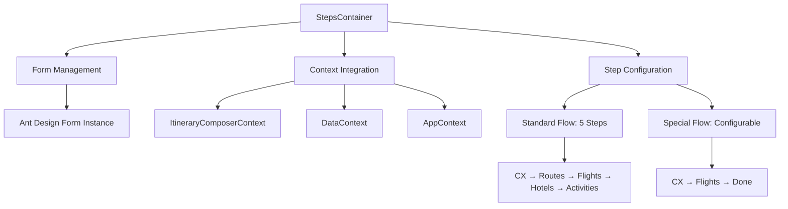

### Key Dependencies

**Contexts Used:**

- `useItineraryComposerContext` - Step data, navigation, and persistence
- `useDataContext` - Hotel/flight search state, IndexedDB operations
- `useAppContext` - User information (name, role)

**Custom Hooks:**

- `useRequestRegistry` - Manages async API requests and prevents duplicates

**Step Components:**

- `InitialDetails` - Customer and trip details
- `Routes` - City-wise itinerary planning
- `Flights` - Flight selection and search
- `Hotels` - Hotel selection and search
- `Activities` - Additional activities and extras

---

## Special Destination Configuration

### Configuration System

**Location:** Top of `StepsContainer.jsx`

**Configuration Object:** `SPECIAL_DESTINATION_CONFIG`

Defines custom flows for specific destinations. Each entry contains:

- `steps` - Array of STEP constants to display
- `skipValidation` - Array of STEP constants to skip during validation

### Helper Functions

**`isSpecialDestination(destination)`**

- Checks if a destination requires special handling
- Returns boolean

**`getSpecialConfig(destination)`**

- Retrieves configuration for a special destination
- Returns config object or null

### How It Works

The component watches the `destination` form field using `Form.useWatch()`:

- When destination changes to a configured special destination (e.g., `"maldives_sis"`)
- The `steps` array is automatically filtered to show only configured steps
- UI adapts reactively without page refresh
- "Done" button appears on the last configured step

**Key Variables:**

- `currentDestination` - Currently selected destination
- `specialConfig` - Retrieved configuration object
- `isSpecialFlow` - Boolean flag indicating special flow is active

---

## Step Flow

### Standard Flow (5 Steps)

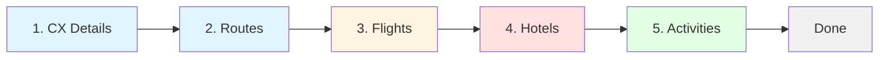

### Special Flow Example (Maldives SIS)

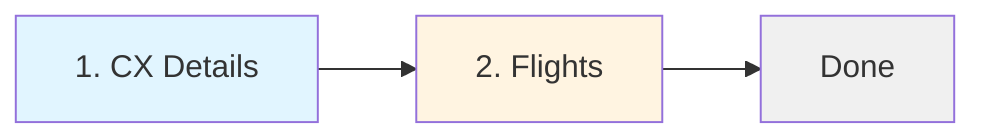

### Step Constants

Defined in `@/utils/itineraryComposerUtils`:

- `STEP.CX = 1` - Customer details
- `STEP.ROUTES = 2` - City itinerary
- `STEP.FLIGHTS = 3` - Flight selection
- `STEP.HOTELS = 4` - Hotel selection
- `STEP.ACTIVITIES = 5` - Activities & extras

### Step Arrays

**`allSteps`** - Memo containing all 5 possible steps with:

- `key` - Unique identifier
- `title` - Display name
- `content` - React component to render
- `step` - STEP constant for filtering

**`steps`** - Computed array based on special destination:

- Filters `allSteps` if `isSpecialFlow` is true
- Otherwise returns all steps
- Used for rendering Steps component and navigation

---

## State Management

### Local State

**`form`** - Ant Design form instance

- Manages all form fields across all steps
- Provides validation, getValue, setValue methods

**`saving`** - Boolean loading state

- Controls button loading indicators during navigation

**`routesState`** - Object containing:

- `isNightsValid` - Whether total nights allocation is correct
- `nightsRemaining` - How many nights left to allocate
- `totalNights` - Total nights from CX step
- `sumNights` - Sum of allocated nights
- `itinerary` - Array of city objects with nights

### Context State

**From `ItineraryComposerContext`:**

- `itData` - Complete step data structure
- `setCurrentStep` - Function to change active step
- `updateStepData` - Function to save step data
- `updateShared` - Function to update shared state
- `checkForCxChangesAndSave` - Handles customer changes
- `loading` - Global loading state
- `setLoading` - Set global loading

**From `DataContext`:**

- `setFetchingStatus` - Hotel search status updates
- `setHotelsFromIndexedDb` - Load cached hotels
- `timestampData` / `setTimestampData` - Cache management
- `getItenerary` - Fetch itinerary data
- `setFetchingFlightData` - Flight search state

### Computed Values

**`currentStepIndex`** - Zero-based index of current step (itData.currentStep - 1)

**`totalNights`** - Total nights from CX step data

**`dealId`** - Extracted from route param `id` by splitting on "_"

**`isLastStep`** - True when on the final step

**`routesValue`** - Computed from either saved Routes data or shared route state

---

## Step Handlers System

### Handler Structure

**`stepHandlers`** object contains handlers for each STEP constant.

Each handler can define:

- **`fields(form, idx)`** - Returns array of field names to validate
- **`values(form, idx)`** - Returns object of values to persist
- **`beforeSave(form, idx)`** - Optional pre-validation logic, return true to prevent save
- **`afterSave({ itData, routesState, updateShared, values })`** - Optional post-save side effects

### Handler Breakdown

**`[STEP.CX]`** - Customer Details

- Validates: customer fields, destination, dates, pax counts
- Persists: All customer and trip parameters
- After Save: Calls `checkForCxChangesAndSave()`

**`[STEP.ROUTES]`** - City Itinerary

- Validates: Nothing (uses state instead of form)
- Persists: `routesState` object
- Before Save: Checks `routesState.isNightsValid`, shows Modal.error if invalid
- After Save: Builds route using `buildRoute()`, creates hotel entries, stores in IndexedDB

**`[STEP.FLIGHTS]`** - Flight Selection

- Validates: Dynamic flight fields via `buildFlightFieldNames()`
- Persists: Flight data via `buildFlightsValue()`
- Before Save: Ensures either flights exist or `flightBookedByGuest` is true
- After Save: Triggers `handleSearchFlights()`

**`[STEP.HOTELS]`** - Hotel Selection

- Validates: `hotels` field array
- Persists: Hotel data via `buildHotelsValue()`
- After Save: Triggers `handleSearchHotels()`

**`default`** - Fallback

- Uses `STEP_FIELDS` mapping for field names
- Generic getValue approach

---

## Navigation System

### Navigation Flow

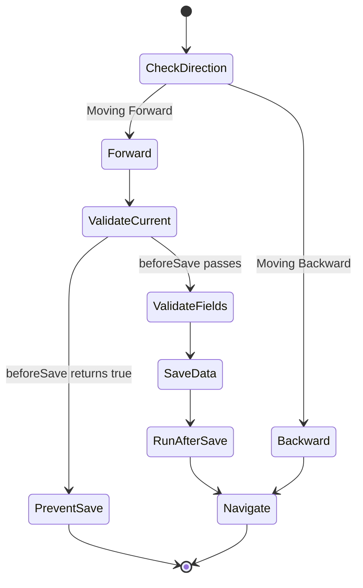

### Key Navigation Functions

**`validateAndSaveCurrent(manualIndex)`**

- Validates and saves the current step
- Can optionally validate a specific step via `manualIndex` parameter
- Runs through: beforeSave → validateFields → getValue → updateStepData → afterSave
- Returns boolean indicating success

**`goToIndex(targetIdx, isMaldives)`**

- Navigates to a specific step index
- Only validates if moving forward
- `isMaldives` parameter skips actual navigation (used for validation-only in special flows)
- Returns validation result

**`handleNext()`**

- Validates current step
- Moves to next step if validation passes
- Sets `saving` state during process

**`handlePrev()`**

- Moves to previous step without validation
- Simply calls `setCurrentStep(itData.currentStep - 1)`

**`onStepChange(targetIdx)`**

- Handles clicking on step indicators in Steps component
- Checks `canNavigateByClick()` before allowing navigation
- Navigates via `goToIndex()`

**`canNavigateByClick(targetIdx)`**

- Returns true if step is clickable
- Allows: backward navigation OR completed steps

**`isStepCompleted(idx)`**

- Checks if step has `savedAt` timestamp
- Used to determine clickability

---

## Search Operations

### Flight Search Flow

**Function:** `handleSearchFlights()`

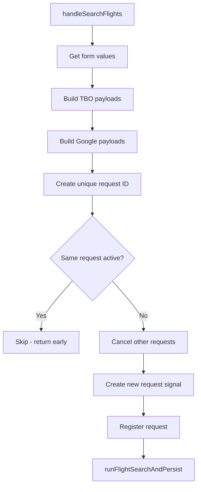

**Process:**

1. Gets all form values
2. Builds TBO payloads via `buildTboFlightPayloads()`
3. Builds Google payloads via `buildGoogleFlightPayloads()`
4. Creates unique request identifier via `createUniqueObjPerRequestFlights()`
5. Checks if same search already active via `isRequestActive()`
6. Cancels other active requests via `cancelFlightRequests()`
7. Creates new request with abort signal
8. Executes search via `runFlightSearchAndPersist()`

**Duplicate Prevention:** Uses unique object based on flight parameters to skip identical searches

### Hotel Search Flow

**Function:** `handleSearchHotels()`

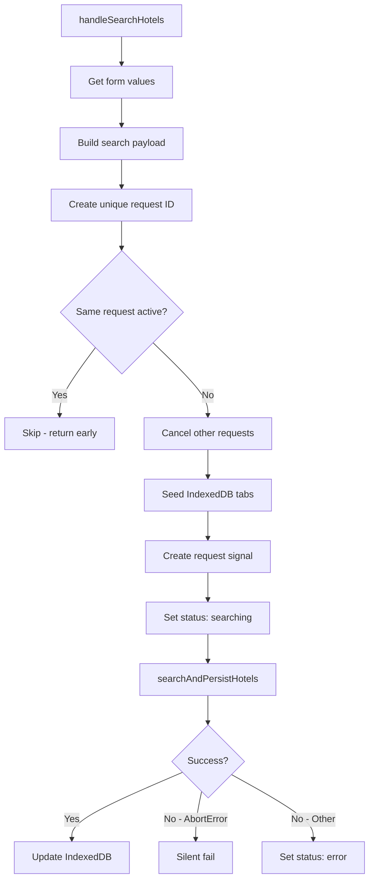

**Process:**

1. Gets form values
2. Builds search payload via `buildHotelSearchPayload()`
3. Creates unique request identifier via `createUniqueObjPerRequestHotels()`
4. Checks if same search already active
5. Cancels other active requests via `cancelHotelRequests()`
6. Seeds IndexedDB tabs via `seedTabsToIndexedDB()`
7. Sets `fetchingStatus` to "searching"
8. Executes search via `searchAndPersistHotels()`
9. Handles AbortError separately from other errors

**Key Difference:** Hotels use IndexedDB for per-city caching

---

## Completion Flow

### Standard Completion

**Function:** `handleComplete()`

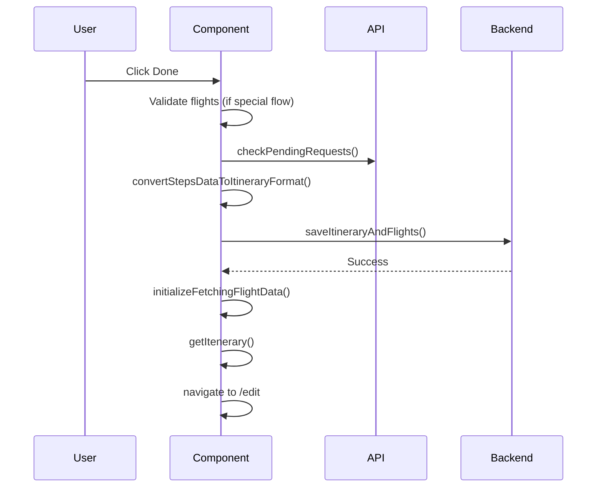

**Steps:**

1. Sets global loading state
2. **Special Flow Only:** Validates flights step manually via `goToIndex(STEP.FLIGHTS, true)`
3. Waits for pending API requests via `checkPendingRequests()`
4. Converts all step data via `convertStepsDataToItineraryFormat()` (passes `isSpecialFlow` flag)
5. Saves to backend via `saveItineraryAndFlights()`
6. Handles errors with message.error()
7. Initializes flight fetching state with `initializeFetchingFlightData()`
8. Reloads itinerary via `getItenerary()`
9. Navigates to `/edit/${id}`

### Special Flow Handling

For special destinations like `maldives_sis`:

- Manually validates the flights step before conversion
- Passes `isSpecialFlow` flag to `convertStepsDataToItineraryFormat()`
- Converter skips validation for missing steps (Routes, Hotels, Activities)

**Key Variable:** `isSpecialFlow` - Ensures proper data conversion without errors

---

## UI Layout

### Layout Overview

```mermaid
graph TB
    subgraph Main["StepsContainer Layout"]
        TB[Top Bar - Close Button]
        SI[Steps Indicator Card]
        
        subgraph Content["Content Area - Row with 2 Columns"]
            subgraph Left["Left Column - 18/24 width"]
                RD[Route Display Card<br/>Conditional: currentStepIndex > 1 AND !isSpecialFlow]
                SC[Step Content Card<br/>Dynamic form based on current step]
            end
            
            subgraph Right["Right Column - 6/24 width"]
                NP[Notes Panel<br/>Persistent notes and comments]
            end
        end
        
        Footer[Fixed Footer<br/>Previous | Quick Plan | Next/Done]
    end
    
    TB --> SI
    SI --> Content
    Content --> Footer
    
    style TB fill:#f0f0f0
    style SI fill:#e1f5ff
    style RD fill:#fff4e1
    style SC fill:#e1ffe1
    style NP fill:#ffe1e1
    style Footer fill:#f0f0f0
```

### Layout Structure Details

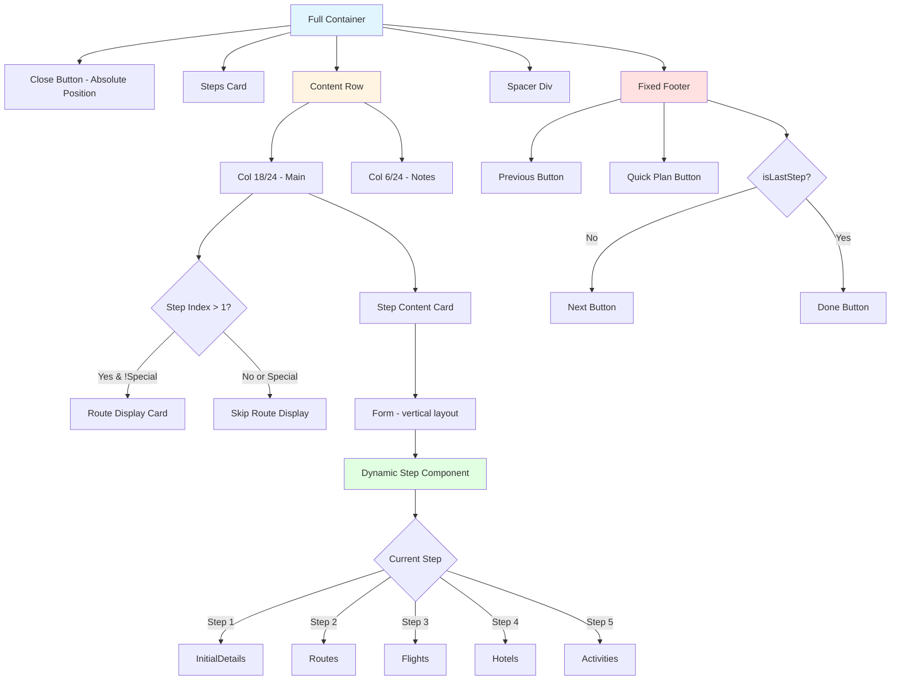

### Conditional Rendering

**Route Display Card:**

- Shows when `currentStepIndex > 1`
- Hidden in special flows (`!isSpecialFlow`)

**Next vs Done Button:**

- Shows "Next" when `!isLastStep`
- Shows "Done" when `isLastStep`

**Loading Overlay:**

- Shows full-screen loader when `loading` is true
- Contains Spin component

---

## Key Functions Reference

### Form Management

| Function | Purpose |
|----------|---------|
| `form.getFieldsValue()` | Retrieves form field values |
| `form.setFieldsValue()` | Sets form field values |
| `form.validateFields(names)` | Validates specific fields |
| `Form.useWatch(field, form)` | Watches field changes reactively |

### Step Navigation

| Function | Purpose |
|----------|---------|
| `validateAndSaveCurrent(manualIndex)` | Validates and saves current/specific step |
| `goToIndex(targetIdx, isMaldives)` | Navigates to specific step index |
| `handleNext()` | Moves to next step with validation |
| `handlePrev()` | Moves to previous step |
| `handleComplete()` | Finalizes and saves entire itinerary |
| `handleClose()` | Closes wizard and returns to edit page |
| `onStepChange(targetIdx)` | Handles step indicator clicks |

### Validation Helpers

| Function | Purpose |
|----------|---------|
| `isStepCompleted(idx)` | Checks if step has been saved |
| `canNavigateByClick(targetIdx)` | Determines if step is clickable |

### Search Operations

| Function | Purpose |
|----------|---------|
| `handleSearchFlights()` | Executes flight API search |
| `handleSearchHotels()` | Executes hotel API search |

### Utilities

| Function | Purpose |
|----------|---------|
| `addDays(dateString, days)` | Adds days to ISO date string |
| `isSpecialDestination(destination)` | Checks if destination is special |
| `getSpecialConfig(destination)` | Gets special destination config |

---

## Data Flow Diagrams

### Form Synchronization on Load

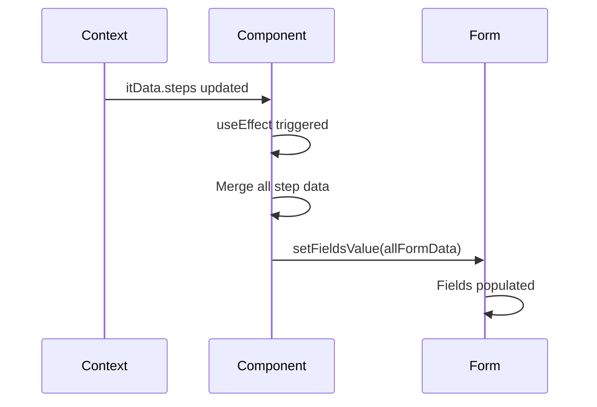

**Trigger:** `useEffect` watching `itData.steps`

**Process:** Reduces all step data into single object, sets form values

### Validation and Save Flow

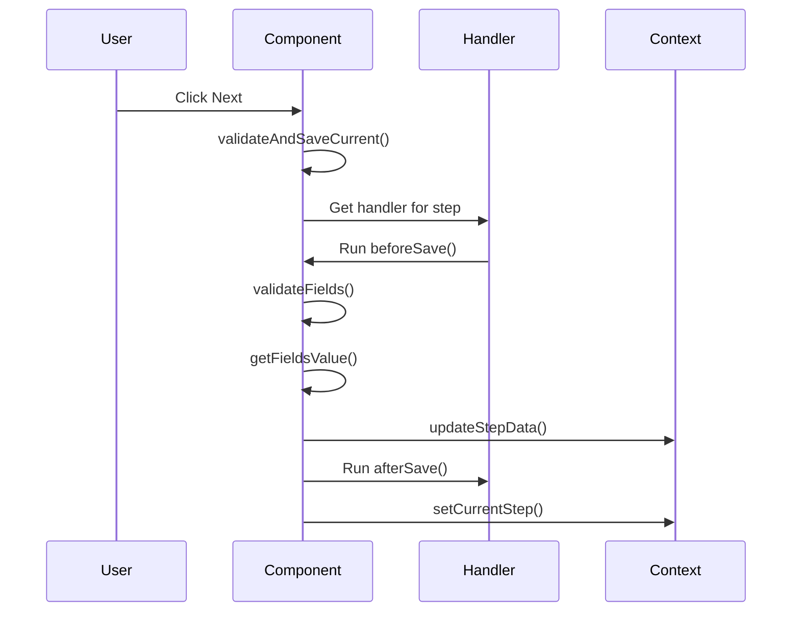

### Special Flow Detection

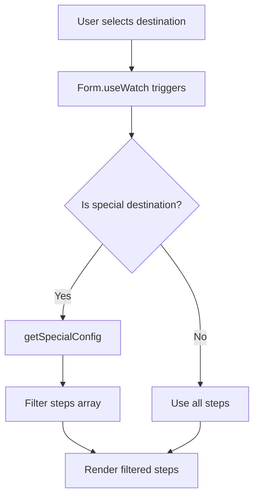

### Routes to Hotels Data Flow

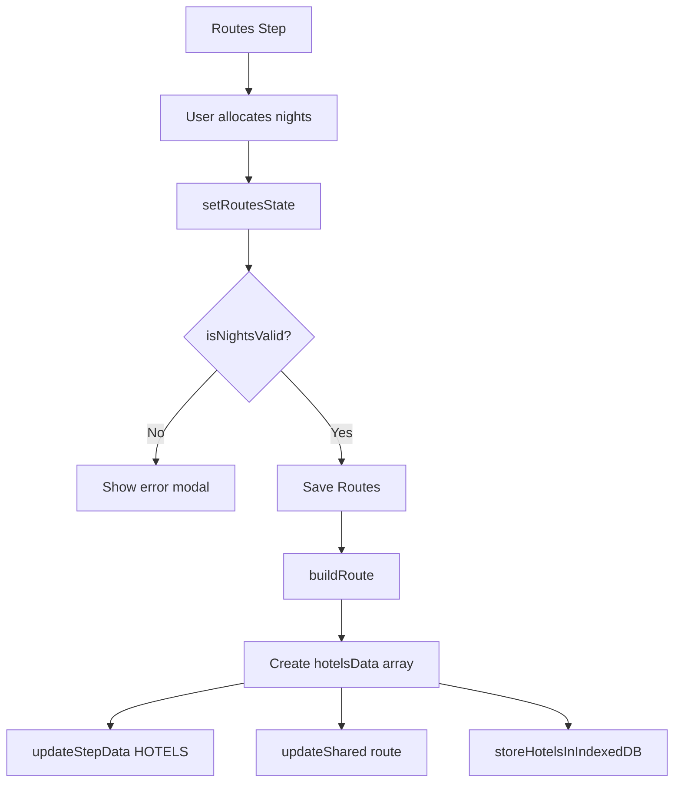

### Complete Flow Decision Tree

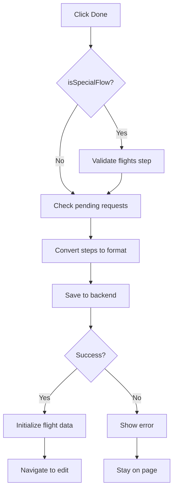

---

## Component Interaction

### Context Connections

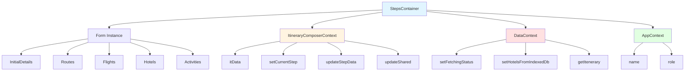

---

## Effect Hooks

### Form Data Sync Effect

**Trigger:** Changes to `itData.steps`

**Purpose:** Merges all step data into form when component mounts or step data updates

**Process:** Reduces step data → Sets form values

### Auto-Redirect Effect

**Trigger:** Changes to `itData.currentStep`

**Purpose:** Redirects to edit page if step exceeds 5 (failsafe)

**Condition:** `itData.currentStep > 5`

---

## Error Handling

### Validation Errors

- Handled by Ant Design Form
- Shows inline field errors
- Prevents navigation

### Business Logic Errors

- Shows Modal.error with descriptive messages
- Returns boolean to prevent save

### API Errors

- Catches in try-catch blocks
- Shows message.error
- Handles AbortError separately

---

## Adding New Features

### Adding a New Step

1. Define STEP constant in `itineraryComposerUtils`
2. Create step component
3. Add to `allSteps` array with proper structure
4. Add handler to `stepHandlers` object
5. Update `convertStepsDataToItineraryFormat` if needed

### Adding a New Special Destination

1. Add entry to `SPECIAL_DESTINATION_CONFIG`
2. Define which steps to show in `steps` array
3. Define which steps to skip in `skipValidation` array
4. Update backend converter to handle missing step data

### Modifying Search Behavior

1. Locate search function (`handleSearchFlights` or `handleSearchHotels`)
2. Modify payload builders (e.g., `buildTboFlightPayloads`)
3. Update unique request identifier logic if needed
4. Adjust search persistence function parameters

---

## Important Variables

### Configuration

- `SPECIAL_DESTINATION_CONFIG` - Special destination flow definitions
- `stepHandlers` - Step validation and persistence logic
- `allSteps` - Complete step definitions
- `steps` - Filtered steps (respects special flow)

### State

- `form` - Ant Design form instance
- `saving` - Button loading state
- `routesState` - Routes step validation state
- `currentStepIndex` - Zero-based active step
- `isSpecialFlow` - Boolean for special destination
- `isLastStep` - Boolean for last step detection

### Context Values

- `itData` - Complete step data structure
- `loading` - Global loading state
- `timestampData` - Cache timestamps for searches

### Computed

- `currentDestination` - Active destination value
- `specialConfig` - Retrieved special config
- `dealId` - Extracted from route params
- `totalNights` - From CX step data

---

## Best Practices

1. **Always use step constants** - Never hardcode step numbers
2. **Check special flow state** - Use `isSpecialFlow` for conditional logic
3. **Use manualIndex parameter** - When validating specific steps outside normal flow
4. **Handle abort errors** - Distinguish between AbortError and actual failures
5. **Update both handlers and converters** - When adding/modifying steps
6. **Test special flows separately** - Different validation paths
7. **Monitor form sync** - Check useEffect dependencies when debugging